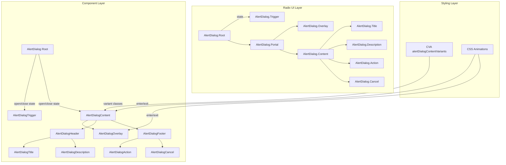

# Design Document: Alert Dialog Component สำหรับ Nim UI

## Overview

Alert Dialog component เพิ่ม feedback/overlay component ให้กับ Nim UI โดยสร้างบน `@radix-ui/react-alert-dialog` primitive ที่จัดการ accessibility (role="alertdialog"), focus trapping, keyboard navigation, และ portal rendering ให้อัตโนมัติ

แนวทางหลัก:
- ใช้ Radix UI AlertDialog primitive เป็น base (เหมือน Popover ใช้ Radix Popover, DropdownMenu ใช้ Radix DropdownMenu)
- ใช้ CVA pattern สำหรับ variant styling ตามแบบแผนของ library
- ใช้ Radix Portal สำหรับ render content นอก DOM hierarchy
- ใช้ CSS animation ที่มีอยู่แล้ว (animate-fade-in, animate-fade-out) สำหรับ enter/exit
- ไฟล์ทั้งหมดอยู่ใน `packages/ui/src/components/` เป็น flat kebab-case
- ใช้ compound component pattern: AlertDialog (Root), AlertDialogTrigger, AlertDialogContent, AlertDialogOverlay, AlertDialogHeader, AlertDialogFooter, AlertDialogTitle, AlertDialogDescription, AlertDialogAction, AlertDialogCancel

ความแตกต่างจาก Modal/Dialog ปกติ:
- Alert Dialog ไม่ปิดเมื่อคลิก overlay (ต้องการการตอบสนองจากผู้ใช้อย่างชัดเจน)
- ใช้ role="alertdialog" แทน role="dialog"
- มี destructive variant สำหรับการกระทำอันตราย

ไฟล์ที่ต้องสร้าง:
- `alert-dialog.tsx` — AlertDialog component ทั้งหมด
- `alert-dialog.test.tsx` — Unit tests และ property-based tests
- อัปเดต `index.ts` — เพิ่ม export

## Architecture



การทำงาน:
1. นักพัฒนาใช้ `AlertDialog` (Root) ครอบ `AlertDialogTrigger` และ `AlertDialogContent`
2. เมื่อผู้ใช้คลิก trigger, Radix จัดการเปิด alert dialog
3. `AlertDialogOverlay` แสดง backdrop และ `AlertDialogContent` แสดงอยู่กลางหน้าจอผ่าน Radix Portal
4. CVA จัดการ variant styling (default / destructive) รวมถึง dark mode classes
5. Focus ถูก trap ภายใน dialog — ผู้ใช้ต้องกด Action หรือ Cancel เพื่อปิด
6. กด Escape ปิด dialog และ focus กลับไปที่ trigger

## Components and Interfaces

### 1. AlertDialog (Root)

Re-export Radix UI AlertDialog Root:

```typescript
export interface AlertDialogProps {
  children: React.ReactNode;
  open?: boolean;
  defaultOpen?: boolean;
  onOpenChange?: (open: boolean) => void;
}

const AlertDialog = AlertDialogPrimitive.Root;
```

### 2. AlertDialogTrigger

```typescript
export type AlertDialogTriggerProps = React.ComponentPropsWithoutRef<
  typeof AlertDialogPrimitive.Trigger
>;

const AlertDialogTrigger = React.forwardRef<
  React.ComponentRef<typeof AlertDialogPrimitive.Trigger>,
  AlertDialogTriggerProps
>(({ className, ...props }, ref) => (
  <AlertDialogPrimitive.Trigger ref={ref} className={cn(className)} {...props} />
));
```

### 3. AlertDialogOverlay

```typescript
export type AlertDialogOverlayProps = React.ComponentPropsWithoutRef<
  typeof AlertDialogPrimitive.Overlay
>;

const AlertDialogOverlay = React.forwardRef<
  React.ComponentRef<typeof AlertDialogPrimitive.Overlay>,
  AlertDialogOverlayProps
>(({ className, ...props }, ref) => (
  <AlertDialogPrimitive.Overlay
    ref={ref}
    className={cn(
      'fixed inset-0 z-50 bg-black/50',
      'data-[state=open]:animate-fade-in data-[state=closed]:animate-fade-out',
      className
    )}
    {...props}
  />
));
```

### 4. alertDialogContentVariants (CVA)

```typescript
const alertDialogContentVariants = cva(
  'fixed left-1/2 top-1/2 z-50 w-full max-w-lg -translate-x-1/2 -translate-y-1/2 rounded-lg p-6 shadow-lg outline-none data-[state=open]:animate-fade-in data-[state=closed]:animate-fade-out',
  {
    variants: {
      variant: {
        default:
          'border border-neutral-200 bg-white text-neutral-900 dark:border-neutral-700 dark:bg-neutral-800 dark:text-neutral-100',
        destructive:
          'border border-neutral-200 border-t-4 border-t-error-500 bg-white text-neutral-900 dark:border-neutral-700 dark:border-t-error-500 dark:bg-neutral-800 dark:text-neutral-100',
      },
    },
    defaultVariants: {
      variant: 'default',
    },
  }
);
```

### 5. AlertDialogContent

```typescript
export interface AlertDialogContentProps
  extends React.ComponentPropsWithoutRef<typeof AlertDialogPrimitive.Content>,
    VariantProps<typeof alertDialogContentVariants> {}

const AlertDialogContent = React.forwardRef<
  React.ComponentRef<typeof AlertDialogPrimitive.Content>,
  AlertDialogContentProps
>(({ className, variant, children, ...props }, ref) => (
  <AlertDialogPrimitive.Portal>
    <AlertDialogOverlay />
    <AlertDialogPrimitive.Content
      ref={ref}
      className={cn(alertDialogContentVariants({ variant }), className)}
      {...props}
    >
      {children}
    </AlertDialogPrimitive.Content>
  </AlertDialogPrimitive.Portal>
));
```

### 6. AlertDialogHeader

```typescript
export interface AlertDialogHeaderProps extends React.HTMLAttributes<HTMLDivElement> {}

const AlertDialogHeader = React.forwardRef<HTMLDivElement, AlertDialogHeaderProps>(
  ({ className, ...props }, ref) => (
    <div
      ref={ref}
      className={cn('flex flex-col gap-2', className)}
      {...props}
    />
  )
);
```

### 7. AlertDialogFooter

```typescript
export interface AlertDialogFooterProps extends React.HTMLAttributes<HTMLDivElement> {}

const AlertDialogFooter = React.forwardRef<HTMLDivElement, AlertDialogFooterProps>(
  ({ className, ...props }, ref) => (
    <div
      ref={ref}
      className={cn('flex justify-end gap-2 mt-4', className)}
      {...props}
    />
  )
);
```

### 8. AlertDialogTitle

```typescript
export type AlertDialogTitleProps = React.ComponentPropsWithoutRef<
  typeof AlertDialogPrimitive.Title
>;

const AlertDialogTitle = React.forwardRef<
  React.ComponentRef<typeof AlertDialogPrimitive.Title>,
  AlertDialogTitleProps
>(({ className, ...props }, ref) => (
  <AlertDialogPrimitive.Title
    ref={ref}
    className={cn('text-lg font-semibold text-neutral-900 dark:text-neutral-100', className)}
    {...props}
  />
));
```

### 9. AlertDialogDescription

```typescript
export type AlertDialogDescriptionProps = React.ComponentPropsWithoutRef<
  typeof AlertDialogPrimitive.Description
>;

const AlertDialogDescription = React.forwardRef<
  React.ComponentRef<typeof AlertDialogPrimitive.Description>,
  AlertDialogDescriptionProps
>(({ className, ...props }, ref) => (
  <AlertDialogPrimitive.Description
    ref={ref}
    className={cn('text-sm text-neutral-500 dark:text-neutral-400', className)}
    {...props}
  />
));
```

### 10. AlertDialogAction

```typescript
export type AlertDialogActionProps = React.ComponentPropsWithoutRef<
  typeof AlertDialogPrimitive.Action
>;

const AlertDialogAction = React.forwardRef<
  React.ComponentRef<typeof AlertDialogPrimitive.Action>,
  AlertDialogActionProps
>(({ className, ...props }, ref) => (
  <AlertDialogPrimitive.Action ref={ref} className={cn(className)} {...props} />
));
```

### 11. AlertDialogCancel

```typescript
export type AlertDialogCancelProps = React.ComponentPropsWithoutRef<
  typeof AlertDialogPrimitive.Cancel
>;

const AlertDialogCancel = React.forwardRef<
  React.ComponentRef<typeof AlertDialogPrimitive.Cancel>,
  AlertDialogCancelProps
>(({ className, ...props }, ref) => (
  <AlertDialogPrimitive.Cancel ref={ref} className={cn(className)} {...props} />
));
```

## Data Models

### AlertDialogContentProps

| Field | Type | Required | Description |
|-------|------|----------|-------------|
| variant | 'default' \| 'destructive' | ❌ | รูปแบบสี (default: 'default') |
| className | string | ❌ | custom CSS classes |
| children | React.ReactNode | ✅ | เนื้อหาของ dialog |

### AlertDialogProps (Root)

| Field | Type | Required | Description |
|-------|------|----------|-------------|
| open | boolean | ❌ | controlled open state |
| defaultOpen | boolean | ❌ | initial open state (uncontrolled) |
| onOpenChange | (open: boolean) => void | ❌ | callback เมื่อ open state เปลี่ยน |
| children | React.ReactNode | ✅ | Trigger + Content |

### AlertDialogHeaderProps / AlertDialogFooterProps

| Field | Type | Required | Description |
|-------|------|----------|-------------|
| className | string | ❌ | custom CSS classes |
| children | React.ReactNode | ✅ | เนื้อหา |

## Correctness Properties

*A property is a characteristic or behavior that should hold true across all valid executions of a system — essentially, a formal statement about what the system should do. Properties serve as the bridge between human-readable specifications and machine-verifiable correctness guarantees.*

### Property 1: Content variant styling includes correct light and dark mode classes

*For any* valid variant value from the set {default, destructive}, the `alertDialogContentVariants` CVA function should produce a class string that contains the correct light mode classes (bg-white, text-neutral-900, border for default; bg-white, text-neutral-900, border-t-error-500 for destructive) AND corresponding dark mode classes (prefixed with `dark:`) AND animation classes (animate-fade-in, animate-fade-out).

**Validates: Requirements 2.1, 2.2, 2.3, 2.4, 2.7**

### Property 2: Module exports completeness

*For any* required export name from the set {AlertDialog, AlertDialogTrigger, AlertDialogContent, AlertDialogOverlay, AlertDialogHeader, AlertDialogFooter, AlertDialogTitle, AlertDialogDescription, AlertDialogAction, AlertDialogCancel, alertDialogContentVariants}, the module should export a defined value.

**Validates: Requirements 7.1, 7.2, 7.3, 7.4**

## Error Handling

AlertDialog component มีกรณี error ที่ต้องจัดการ:

1. **AlertDialogContent ถูกใช้นอก AlertDialog Root**: Radix จะ throw error ถ้า Content อยู่นอก Root — เป็น developer error ที่ TypeScript types ช่วยป้องกันได้บางส่วน

2. **AlertDialog trigger element ไม่รองรับ ref**: Radix AlertDialog.Trigger ต้องการ ref forwarding — ถ้า trigger เป็น custom component ที่ไม่ forward ref จะแสดง React warning ใน console

3. **Portal container ไม่มีอยู่**: Radix Portal จะ render ไปที่ document.body เป็น default — ถ้า document.body ไม่พร้อม (SSR) จะไม่ render content

4. **ไม่มี Title หรือ Description**: Radix จะแสดง console warning ถ้า AlertDialog.Content ไม่มี AlertDialog.Title หรือ AlertDialog.Description เพราะจำเป็นสำหรับ accessibility (aria-labelledby, aria-describedby)

5. **Overlay click ไม่ปิด dialog**: ต่างจาก Modal/Dialog ปกติ, Alert Dialog ไม่ปิดเมื่อคลิก overlay — นี่เป็น behavior ที่ถูกต้องตาม WAI-ARIA alertdialog pattern เพราะต้องการการตอบสนองจากผู้ใช้อย่างชัดเจน

## Testing Strategy

### Dual Testing Approach

ใช้ทั้ง unit tests และ property-based tests ร่วมกัน:

- **Unit tests** (Vitest + React Testing Library): ทดสอบ rendering, interactions, accessibility, edge cases
- **Property-based tests** (fast-check): ทดสอบ universal properties ข้าม inputs ทั้งหมด

### Property-Based Testing

ใช้ `fast-check` library ที่มีอยู่แล้วใน project

**Configuration**:
- Minimum 100 iterations ต่อ property test
- แต่ละ test ต้อง reference design document property
- Tag format: **Feature: alert-dialog, Property {number}: {property_text}**
- แต่ละ correctness property ต้องถูก implement เป็น property-based test เดียว

**Property tests ที่ต้องเขียน**:

1. **Property 1**: Variant styling — generate random variants, verify CVA output contains correct light/dark/animation classes
2. **Property 2**: Module exports — verify all required exports exist and are defined

### Unit Tests

Unit tests จะเน้น:

- **Rendering**: AlertDialog renders trigger, Content renders in portal when open, Overlay renders
- **Variants**: default variant has bg-white and border, destructive variant has border-t-error-500
- **Interactions**: click trigger opens dialog, Action closes dialog, Cancel closes dialog
- **Accessibility**: role="alertdialog", aria-labelledby, aria-describedby, focus trapping, Escape closes, focus returns to trigger
- **Overlay**: overlay does not close dialog on click (unlike regular dialog)
- **Defaults**: default variant is applied when no variant specified
- **Sub-components**: Header renders with flex-col, Footer renders with flex justify-end, Title renders with text-lg, Description renders with text-sm
- **Edge cases**: controlled mode (open/onOpenChange), custom className, forwardRef works on all components

### Test File Organization

- ไฟล์ test หลัก: `packages/ui/src/components/alert-dialog.test.tsx`
- ทั้ง unit tests และ property-based tests อยู่ในไฟล์เดียวกัน
- จัดกลุ่มด้วย `describe` blocks: rendering, variants, interactions, accessibility, overlay, defaults, edge cases, properties
