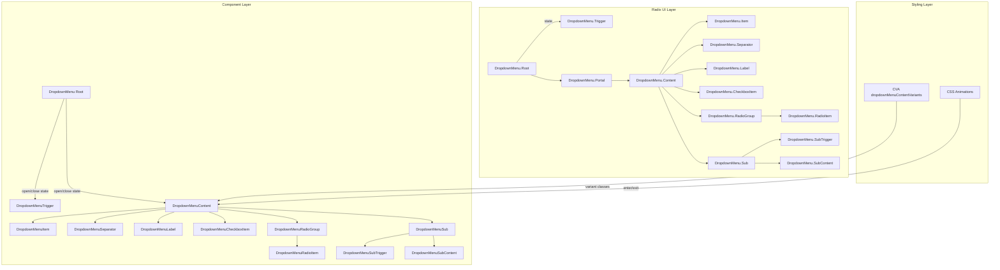

# Design Document: Dropdown Menu Component สำหรับ Tiinno UI

## Overview

Dropdown Menu component เพิ่ม navigation/overlay component ให้กับ Tiinno UI โดยสร้างบน `@radix-ui/react-dropdown-menu` primitive ที่จัดการ accessibility, positioning, keyboard navigation, focus management, และ sub-menu interactions ให้อัตโนมัติ

แนวทางหลัก:
- ใช้ Radix UI DropdownMenu primitive เป็น base (เหมือน Tooltip ใช้ Radix Tooltip, Popover ใช้ Radix Popover)
- ใช้ CVA pattern สำหรับ variant styling ตามแบบแผนของ library
- ใช้ Radix Portal สำหรับ render dropdown content นอก DOM hierarchy
- ใช้ CSS animation ที่มีอยู่แล้ว (animate-fade-in, animate-fade-out) สำหรับ enter/exit
- ไฟล์ทั้งหมดอยู่ใน `packages/ui/src/components/` เป็น flat kebab-case
- ใช้ compound component pattern: DropdownMenu (Root), DropdownMenuTrigger, DropdownMenuContent, DropdownMenuItem, DropdownMenuSeparator, DropdownMenuLabel, DropdownMenuCheckboxItem, DropdownMenuRadioGroup, DropdownMenuRadioItem, DropdownMenuSub, DropdownMenuSubTrigger, DropdownMenuSubContent

ไฟล์ที่ต้องสร้าง:
- `dropdown-menu.tsx` — DropdownMenu component ทั้งหมด
- `dropdown-menu.test.tsx` — Unit tests และ property-based tests
- อัปเดต `index.ts` — เพิ่ม export

## Architecture



การทำงาน:
1. นักพัฒนาใช้ `DropdownMenu` (Root) ครอบ `DropdownMenuTrigger` และ `DropdownMenuContent`
2. เมื่อผู้ใช้คลิก trigger, Radix จัดการเปิด dropdown menu
3. `DropdownMenuContent` ถูก render ผ่าน Radix Portal ที่ตำแหน่งตาม `side` prop
4. CVA จัดการ variant styling (default / outline) รวมถึง dark mode classes
5. ผู้ใช้สามารถ navigate ด้วย Arrow keys, เลือกด้วย Enter/Space, ปิดด้วย Escape
6. เมื่อผู้ใช้คลิกนอก menu หรือเลือก item, dropdown ปิดพร้อม exit animation

## Components and Interfaces

### 1. DropdownMenu (Root) (`dropdown-menu.tsx`)

Re-export Radix UI DropdownMenu Root:

```typescript
export interface DropdownMenuProps {
  children: React.ReactNode;
  open?: boolean;
  defaultOpen?: boolean;
  onOpenChange?: (open: boolean) => void;
  dir?: 'ltr' | 'rtl';
  modal?: boolean;
}

const DropdownMenu = DropdownMenuPrimitive.Root;
```

### 2. DropdownMenuTrigger (`dropdown-menu.tsx`)

Re-export Radix UI DropdownMenu Trigger ด้วย forwardRef:

```typescript
export type DropdownMenuTriggerProps = React.ComponentPropsWithoutRef<
  typeof DropdownMenuPrimitive.Trigger
>;

const DropdownMenuTrigger = React.forwardRef<
  React.ComponentRef<typeof DropdownMenuPrimitive.Trigger>,
  DropdownMenuTriggerProps
>(({ className, ...props }, ref) => (
  <DropdownMenuPrimitive.Trigger ref={ref} className={cn(className)} {...props} />
));
```

### 3. DropdownMenuContent (`dropdown-menu.tsx`)

Component หลักที่ใช้ CVA สำหรับ variant styling:

```typescript
const dropdownMenuContentVariants = cva(
  'z-50 min-w-[8rem] overflow-hidden rounded-md p-1 shadow-md outline-none data-[state=open]:animate-fade-in data-[state=closed]:animate-fade-out',
  {
    variants: {
      variant: {
        default:
          'border border-neutral-200 bg-white text-neutral-900 dark:border-neutral-700 dark:bg-neutral-800 dark:text-neutral-100',
        outline:
          'border-2 border-neutral-300 bg-white text-neutral-900 dark:border-neutral-600 dark:bg-neutral-800 dark:text-neutral-100',
      },
    },
    defaultVariants: {
      variant: 'default',
    },
  }
);

export interface DropdownMenuContentProps
  extends React.ComponentPropsWithoutRef<typeof DropdownMenuPrimitive.Content>,
    VariantProps<typeof dropdownMenuContentVariants> {
  sideOffset?: number;
}

const DropdownMenuContent = React.forwardRef<
  React.ComponentRef<typeof DropdownMenuPrimitive.Content>,
  DropdownMenuContentProps
>(({ className, variant, sideOffset = 4, side = 'bottom', ...props }, ref) => (
  <DropdownMenuPrimitive.Portal>
    <DropdownMenuPrimitive.Content
      ref={ref}
      side={side}
      sideOffset={sideOffset}
      className={cn(dropdownMenuContentVariants({ variant }), className)}
      {...props}
    />
  </DropdownMenuPrimitive.Portal>
));
```

### 4. DropdownMenuItem (`dropdown-menu.tsx`)

รายการเมนูแต่ละรายการ:

```typescript
export interface DropdownMenuItemProps
  extends React.ComponentPropsWithoutRef<typeof DropdownMenuPrimitive.Item> {
  inset?: boolean;
}

const DropdownMenuItem = React.forwardRef<
  React.ComponentRef<typeof DropdownMenuPrimitive.Item>,
  DropdownMenuItemProps
>(({ className, inset, ...props }, ref) => (
  <DropdownMenuPrimitive.Item
    ref={ref}
    className={cn(
      'relative flex cursor-default select-none items-center rounded-sm px-2 py-1.5 text-sm outline-none',
      'focus:bg-primary-500 focus:text-white',
      'dark:focus:bg-primary-600 dark:focus:text-white',
      'data-[disabled]:pointer-events-none data-[disabled]:opacity-50',
      inset && 'pl-8',
      className
    )}
    {...props}
  />
));
```

### 5. DropdownMenuSeparator (`dropdown-menu.tsx`)

เส้นแบ่งระหว่างกลุ่ม:

```typescript
export type DropdownMenuSeparatorProps = React.ComponentPropsWithoutRef<
  typeof DropdownMenuPrimitive.Separator
>;

const DropdownMenuSeparator = React.forwardRef<
  React.ComponentRef<typeof DropdownMenuPrimitive.Separator>,
  DropdownMenuSeparatorProps
>(({ className, ...props }, ref) => (
  <DropdownMenuPrimitive.Separator
    ref={ref}
    className={cn('-mx-1 my-1 h-px bg-neutral-200 dark:bg-neutral-700', className)}
    {...props}
  />
));
```

### 6. DropdownMenuLabel (`dropdown-menu.tsx`)

Label สำหรับกลุ่มรายการ:

```typescript
export interface DropdownMenuLabelProps
  extends React.ComponentPropsWithoutRef<typeof DropdownMenuPrimitive.Label> {
  inset?: boolean;
}

const DropdownMenuLabel = React.forwardRef<
  React.ComponentRef<typeof DropdownMenuPrimitive.Label>,
  DropdownMenuLabelProps
>(({ className, inset, ...props }, ref) => (
  <DropdownMenuPrimitive.Label
    ref={ref}
    className={cn(
      'px-2 py-1.5 text-sm font-semibold text-neutral-500 dark:text-neutral-400',
      inset && 'pl-8',
      className
    )}
    {...props}
  />
));
```

### 7. DropdownMenuCheckboxItem (`dropdown-menu.tsx`)

รายการเมนูแบบ checkbox:

```typescript
export interface DropdownMenuCheckboxItemProps
  extends React.ComponentPropsWithoutRef<typeof DropdownMenuPrimitive.CheckboxItem> {}

const DropdownMenuCheckboxItem = React.forwardRef<
  React.ComponentRef<typeof DropdownMenuPrimitive.CheckboxItem>,
  DropdownMenuCheckboxItemProps
>(({ className, children, checked, ...props }, ref) => (
  <DropdownMenuPrimitive.CheckboxItem
    ref={ref}
    className={cn(
      'relative flex cursor-default select-none items-center rounded-sm py-1.5 pl-8 pr-2 text-sm outline-none',
      'focus:bg-primary-500 focus:text-white',
      'dark:focus:bg-primary-600 dark:focus:text-white',
      'data-[disabled]:pointer-events-none data-[disabled]:opacity-50',
      className
    )}
    checked={checked}
    {...props}
  >
    <span className="absolute left-2 flex h-3.5 w-3.5 items-center justify-center">
      <DropdownMenuPrimitive.ItemIndicator>
        <CheckIcon className="h-4 w-4" />
      </DropdownMenuPrimitive.ItemIndicator>
    </span>
    {children}
  </DropdownMenuPrimitive.CheckboxItem>
));
```

### 8. DropdownMenuRadioGroup และ RadioItem (`dropdown-menu.tsx`)

```typescript
export type DropdownMenuRadioGroupProps = React.ComponentPropsWithoutRef<
  typeof DropdownMenuPrimitive.RadioGroup
>;

const DropdownMenuRadioGroup = DropdownMenuPrimitive.RadioGroup;

export interface DropdownMenuRadioItemProps
  extends React.ComponentPropsWithoutRef<typeof DropdownMenuPrimitive.RadioItem> {}

const DropdownMenuRadioItem = React.forwardRef<
  React.ComponentRef<typeof DropdownMenuPrimitive.RadioItem>,
  DropdownMenuRadioItemProps
>(({ className, children, ...props }, ref) => (
  <DropdownMenuPrimitive.RadioItem
    ref={ref}
    className={cn(
      'relative flex cursor-default select-none items-center rounded-sm py-1.5 pl-8 pr-2 text-sm outline-none',
      'focus:bg-primary-500 focus:text-white',
      'dark:focus:bg-primary-600 dark:focus:text-white',
      'data-[disabled]:pointer-events-none data-[disabled]:opacity-50',
      className
    )}
    {...props}
  >
    <span className="absolute left-2 flex h-3.5 w-3.5 items-center justify-center">
      <DropdownMenuPrimitive.ItemIndicator>
        <DotIcon className="h-4 w-4 fill-current" />
      </DropdownMenuPrimitive.ItemIndicator>
    </span>
    {children}
  </DropdownMenuPrimitive.RadioItem>
));
```

### 9. DropdownMenuSub, SubTrigger, SubContent (`dropdown-menu.tsx`)

```typescript
export type DropdownMenuSubProps = React.ComponentPropsWithoutRef<
  typeof DropdownMenuPrimitive.Sub
>;

const DropdownMenuSub = DropdownMenuPrimitive.Sub;

export interface DropdownMenuSubTriggerProps
  extends React.ComponentPropsWithoutRef<typeof DropdownMenuPrimitive.SubTrigger> {
  inset?: boolean;
}

const DropdownMenuSubTrigger = React.forwardRef<
  React.ComponentRef<typeof DropdownMenuPrimitive.SubTrigger>,
  DropdownMenuSubTriggerProps
>(({ className, inset, children, ...props }, ref) => (
  <DropdownMenuPrimitive.SubTrigger
    ref={ref}
    className={cn(
      'relative flex cursor-default select-none items-center rounded-sm px-2 py-1.5 text-sm outline-none',
      'focus:bg-primary-500 focus:text-white',
      'data-[state=open]:bg-neutral-100 dark:data-[state=open]:bg-neutral-700',
      'dark:focus:bg-primary-600 dark:focus:text-white',
      inset && 'pl-8',
      className
    )}
    {...props}
  >
    {children}
    <ChevronRightIcon className="ml-auto h-4 w-4" />
  </DropdownMenuPrimitive.SubTrigger>
));

export interface DropdownMenuSubContentProps
  extends React.ComponentPropsWithoutRef<typeof DropdownMenuPrimitive.SubContent>,
    VariantProps<typeof dropdownMenuContentVariants> {}

const DropdownMenuSubContent = React.forwardRef<
  React.ComponentRef<typeof DropdownMenuPrimitive.SubContent>,
  DropdownMenuSubContentProps
>(({ className, variant, ...props }, ref) => (
  <DropdownMenuPrimitive.Portal>
    <DropdownMenuPrimitive.SubContent
      ref={ref}
      className={cn(dropdownMenuContentVariants({ variant }), className)}
      {...props}
    />
  </DropdownMenuPrimitive.Portal>
));
```

### Inline SVG Icons

Component จะใช้ inline SVG icons แทนการ import จาก icon library เพื่อลด dependencies:

```typescript
// Check icon สำหรับ CheckboxItem
const CheckIcon = ({ className }: { className?: string }) => (
  <svg xmlns="http://www.w3.org/2000/svg" viewBox="0 0 24 24" fill="none"
    stroke="currentColor" strokeWidth={2} strokeLinecap="round" strokeLinejoin="round"
    className={className}>
    <polyline points="20 6 9 17 4 12" />
  </svg>
);

// Dot icon สำหรับ RadioItem
const DotIcon = ({ className }: { className?: string }) => (
  <svg xmlns="http://www.w3.org/2000/svg" viewBox="0 0 24 24" className={className}>
    <circle cx="12" cy="12" r="5" />
  </svg>
);

// Chevron right icon สำหรับ SubTrigger
const ChevronRightIcon = ({ className }: { className?: string }) => (
  <svg xmlns="http://www.w3.org/2000/svg" viewBox="0 0 24 24" fill="none"
    stroke="currentColor" strokeWidth={2} strokeLinecap="round" strokeLinejoin="round"
    className={className}>
    <polyline points="9 18 15 12 9 6" />
  </svg>
);
```

## Data Models

### DropdownMenuContentProps

| Field | Type | Required | Description |
|-------|------|----------|-------------|
| variant | 'default' \| 'outline' | ❌ | รูปแบบสี (default: 'default') |
| side | 'top' \| 'bottom' \| 'left' \| 'right' | ❌ | ตำแหน่งแสดงผล (default: 'bottom') |
| sideOffset | number | ❌ | ระยะห่างจาก trigger เป็น px (default: 4) |
| className | string | ❌ | custom CSS classes |
| children | React.ReactNode | ✅ | รายการเมนู |

### DropdownMenuProps (Root)

| Field | Type | Required | Description |
|-------|------|----------|-------------|
| open | boolean | ❌ | controlled open state |
| defaultOpen | boolean | ❌ | initial open state (uncontrolled) |
| onOpenChange | (open: boolean) => void | ❌ | callback เมื่อ open state เปลี่ยน |
| dir | 'ltr' \| 'rtl' | ❌ | text direction |
| modal | boolean | ❌ | modal mode |
| children | React.ReactNode | ✅ | Trigger + Content |

### DropdownMenuItemProps

| Field | Type | Required | Description |
|-------|------|----------|-------------|
| inset | boolean | ❌ | เพิ่ม padding ซ้ายเพื่อจัดแนวกับ label |
| disabled | boolean | ❌ | ปิดการ interaction |
| onSelect | (event: Event) => void | ❌ | callback เมื่อ item ถูกเลือก |
| className | string | ❌ | custom CSS classes |
| children | React.ReactNode | ✅ | เนื้อหาของ item |

### DropdownMenuCheckboxItemProps

| Field | Type | Required | Description |
|-------|------|----------|-------------|
| checked | boolean | ❌ | checkbox state |
| onCheckedChange | (checked: boolean) => void | ❌ | callback เมื่อ checked เปลี่ยน |
| disabled | boolean | ❌ | ปิดการ interaction |
| className | string | ❌ | custom CSS classes |
| children | React.ReactNode | ✅ | เนื้อหาของ item |

### DropdownMenuRadioGroupProps

| Field | Type | Required | Description |
|-------|------|----------|-------------|
| value | string | ❌ | selected value |
| onValueChange | (value: string) => void | ❌ | callback เมื่อ value เปลี่ยน |
| children | React.ReactNode | ✅ | RadioItem children |

### DropdownMenuLabelProps

| Field | Type | Required | Description |
|-------|------|----------|-------------|
| inset | boolean | ❌ | เพิ่ม padding ซ้าย |
| className | string | ❌ | custom CSS classes |
| children | React.ReactNode | ✅ | ข้อความ label |

### DropdownMenuSubTriggerProps

| Field | Type | Required | Description |
|-------|------|----------|-------------|
| inset | boolean | ❌ | เพิ่ม padding ซ้าย |
| disabled | boolean | ❌ | ปิดการ interaction |
| className | string | ❌ | custom CSS classes |
| children | React.ReactNode | ✅ | เนื้อหาของ sub trigger |


## Correctness Properties

*A property is a characteristic or behavior that should hold true across all valid executions of a system — essentially, a formal statement about what the system should do. Properties serve as the bridge between human-readable specifications and machine-verifiable correctness guarantees.*

### Property 1: Content variant styling includes correct light and dark mode classes

*For any* valid variant value from the set {default, outline}, the `dropdownMenuContentVariants` CVA function should produce a class string that contains the correct light mode classes (bg-white/text-neutral-900/border for default, bg-white/text-neutral-900/border-2 for outline) AND corresponding dark mode classes (prefixed with `dark:`) AND animation classes (animate-fade-in, animate-fade-out).

**Validates: Requirements 2.1, 2.2, 2.3, 2.4, 2.10**

### Property 2: Inset prop adds left padding across components

*For any* component that supports the inset prop (DropdownMenuItem, DropdownMenuLabel, DropdownMenuSubTrigger), when inset is true, the rendered element should contain the `pl-8` class, and when inset is false or undefined, the rendered element should not contain the `pl-8` class.

**Validates: Requirements 3.4, 4.4, 7.3**

### Property 3: CheckboxItem indicator matches checked state

*For any* boolean value of checked, when DropdownMenuCheckboxItem is rendered with that checked value, the check indicator icon should be visible if and only if checked is true.

**Validates: Requirements 5.1, 5.3**

### Property 4: RadioItem indicator matches selected value

*For any* set of radio items within a DropdownMenuRadioGroup, when a value is selected, the dot indicator icon should be visible only on the RadioItem whose value matches the group's selected value.

**Validates: Requirements 6.1, 6.3**

### Property 5: Module exports completeness

*For any* required export name from the set {DropdownMenu, DropdownMenuTrigger, DropdownMenuContent, DropdownMenuItem, DropdownMenuSeparator, DropdownMenuLabel, DropdownMenuCheckboxItem, DropdownMenuRadioGroup, DropdownMenuRadioItem, DropdownMenuSub, DropdownMenuSubTrigger, DropdownMenuSubContent, dropdownMenuContentVariants}, the module should export a defined value.

**Validates: Requirements 9.1, 9.2, 9.3, 9.4**

## Error Handling

DropdownMenu component มีกรณี error ที่ต้องจัดการ:

1. **DropdownMenuContent ถูกใช้นอก DropdownMenu Root**: Radix จะ throw error ถ้า Content อยู่นอก Root — เป็น developer error ที่ TypeScript types ช่วยป้องกันได้บางส่วน

2. **DropdownMenu trigger element ไม่รองรับ ref**: Radix DropdownMenu.Trigger ต้องการ ref forwarding — ถ้า trigger เป็น custom component ที่ไม่ forward ref จะแสดง React warning ใน console

3. **Portal container ไม่มีอยู่**: Radix Portal จะ render ไปที่ document.body เป็น default — ถ้า document.body ไม่พร้อม (SSR) จะไม่ render dropdown content

4. **Side collision**: เมื่อ dropdown ไม่มีพื้นที่เพียงพอที่ side ที่กำหนด, Radix จะ flip ไปด้านตรงข้ามอัตโนมัติผ่าน collision detection ในตัว

5. **RadioGroup ไม่มี value**: ถ้า RadioGroup ไม่มี value prop, จะทำงานใน uncontrolled mode — Radix จัดการ state ภายในอัตโนมัติ

6. **Disabled items**: Radix จัดการ disabled items อัตโนมัติ — items ที่ disabled จะถูกข้ามเมื่อ navigate ด้วย keyboard

## Testing Strategy

### Dual Testing Approach

ใช้ทั้ง unit tests และ property-based tests ร่วมกัน:

- **Unit tests** (Vitest + React Testing Library): ทดสอบ rendering, interactions, accessibility, edge cases
- **Property-based tests** (fast-check): ทดสอบ universal properties ข้าม inputs ทั้งหมด

### Property-Based Testing

ใช้ `fast-check` library ที่มีอยู่แล้วใน project

**Configuration**:
- Minimum 100 iterations ต่อ property test
- แต่ละ test ต้อง reference design document property
- Tag format: **Feature: dropdown-menu, Property {number}: {property_text}**
- แต่ละ correctness property ต้องถูก implement เป็น property-based test เดียว

**Property tests ที่ต้องเขียน**:

1. **Property 1**: Variant styling — generate random variants, verify CVA output contains correct light/dark/animation classes
2. **Property 2**: Inset prop — generate random (component, inset) combinations, verify pl-8 class presence matches inset boolean
3. **Property 3**: CheckboxItem indicator — generate random checked booleans, verify indicator presence matches checked state
4. **Property 4**: RadioItem indicator — generate random selected values, verify indicator presence matches selected value
5. **Property 5**: Module exports — verify all required exports exist and are defined

### Unit Tests

Unit tests จะเน้น:

- **Rendering**: DropdownMenu renders with default props, Content renders in portal, items render correctly
- **Variants**: แต่ละ variant render ด้วย classes ที่ถูกต้อง
- **Interactions**: click เปิด menu, click item ปิด menu, click outside ปิด, Escape ปิด
- **Keyboard**: Arrow Down/Up navigate items, Enter/Space select item
- **Accessibility**: role="menu", role="menuitem", focus management, keyboard navigation
- **Defaults**: default side เป็น bottom, default sideOffset เป็น 4
- **Sub-components**: Separator renders, Label renders, CheckboxItem toggles, RadioItem selects
- **Sub-menu**: SubTrigger opens sub-menu, SubContent renders
- **Edge cases**: controlled mode (open/onOpenChange), custom className, forwardRef, disabled items

### Test File Organization

- ไฟล์ test หลัก: `packages/ui/src/components/dropdown-menu.test.tsx`
- ทั้ง unit tests และ property-based tests อยู่ในไฟล์เดียวกัน
- จัดกลุ่มด้วย `describe` blocks: rendering, variants, interactions, keyboard, accessibility, checkbox, radio, sub-menu, properties
