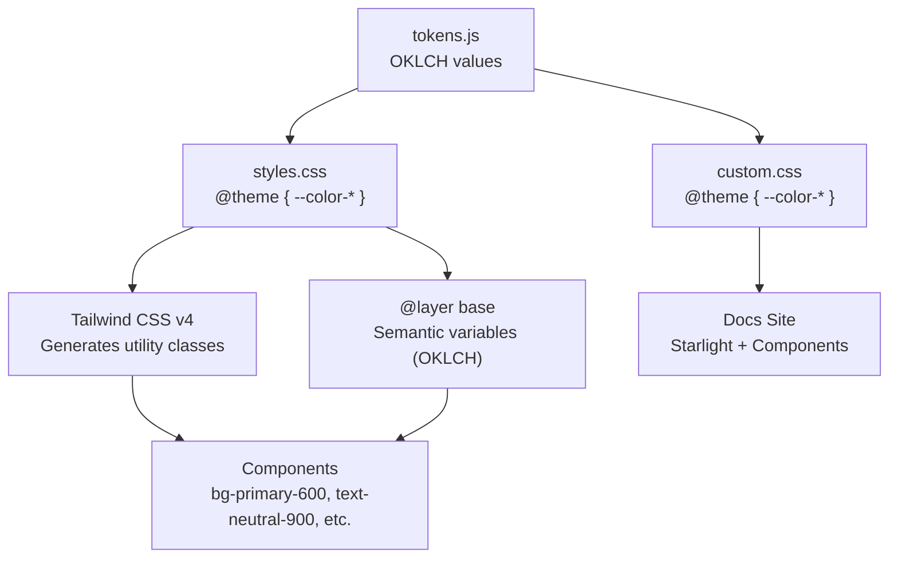

# Design Document: ระบบสี OKLCH

## Overview

การย้ายระบบสีของ Tiinno UI จาก Hex เป็น OKLCH เป็นการเปลี่ยนแปลงที่เกิดขึ้นที่ระดับ design token และ CSS configuration เท่านั้น — component source code ไม่ต้องเปลี่ยนแปลงเลย เพราะ component ใช้ Tailwind utility class (เช่น `bg-primary-600`) ซึ่ง resolve ค่าจาก CSS custom properties

### ทำไมต้อง OKLCH?

1. **Perceptually uniform** — ค่า Lightness ใน OKLCH สอดคล้องกับการรับรู้ของมนุษย์ ต่างจาก HSL ที่ lightness ไม่สม่ำเสมอ
2. **Wide gamut** — รองรับ P3 display ที่มีขอบเขตสีกว้างกว่า sRGB
3. **Tailwind CSS v4 native** — Tailwind v4 รองรับ OKLCH โดยตรงใน `@theme` directive
4. **Predictable manipulation** — การปรับ lightness/chroma ให้ผลลัพธ์ที่คาดเดาได้

### ขอบเขตการเปลี่ยนแปลง

```
packages/tailwind-config/src/tokens.js  ← ค่าสี Hex → OKLCH
packages/ui/src/styles.css              ← @theme + @layer base → OKLCH
packages/docs/src/styles/custom.css     ← @theme + Starlight vars → OKLCH
.kiro/steering/design-tokens.md         ← อัปเดตเอกสาร
```

Component files (button.tsx, badge.tsx, etc.) ไม่ต้องแก้ไข

## Architecture

### การไหลของค่าสีในระบบ



### กลยุทธ์การแปลง

การแปลงเป็นแบบ one-way: Hex → OKLCH ทั้งหมดในครั้งเดียว ไม่มี fallback กลับไป Hex

1. สร้าง conversion script ที่แปลง Hex → OKLCH
2. อัปเดต `tokens.js` ด้วยค่า OKLCH
3. อัปเดต `styles.css` — ทั้ง `@theme` block และ `@layer base` semantic variables
4. อัปเดต `custom.css` — ทั้ง `@theme` block, Starlight variables, และ Pagefind variables
5. อัปเดต steering file
6. ตรวจสอบว่า build + test ผ่าน

## Components and Interfaces

### 1. Conversion Script (`scripts/convert-colors.js`)

Node.js script สำหรับแปลง Hex → OKLCH ใช้ library `culori` ซึ่งเป็น color science library ที่รองรับ OKLCH

```typescript
interface ColorConversion {
  hex: string;        // Input: "#0ea5e9"
  oklch: string;      // Output: "oklch(0.685 0.169 237.3)"
  deltaE: number;     // Round-trip accuracy metric
}

// API
function hexToOklch(hex: string): string;
function oklchToHex(oklch: string): string;
function calculateDeltaE(hex1: string, hex2: string): number;
```

### 2. Token System (`packages/tailwind-config/src/tokens.js`)

โครงสร้างเดิมคงเหมือนเดิม เปลี่ยนเฉพาะค่า:

```javascript
// Before
primary: { 500: '#0ea5e9' }

// After
primary: { 500: 'oklch(0.685 0.169 237.3)' }
```

### 3. Theme Configuration (`packages/ui/src/styles.css`)

`@theme` block เปลี่ยนค่าจาก Hex เป็น OKLCH:

```css
/* Before */
@theme {
  --color-primary-500: #0ea5e9;
}

/* After */
@theme {
  --color-primary-500: oklch(0.685 0.169 237.3);
}
```

`@layer base` semantic variables เปลี่ยนจาก HSL เป็น OKLCH:

```css
/* Before */
:root {
  --primary: 199 89% 48%;  /* HSL components */
}

/* After */
:root {
  --primary: oklch(0.685 0.169 237.3);
}
```

### 4. Docs Custom CSS (`packages/docs/src/styles/custom.css`)

อัปเดต 3 ส่วน:
- `@theme` block → OKLCH values
- Starlight accent variables (`--sl-color-accent-*`) → OKLCH values
- Pagefind UI variables → OKLCH values

## Data Models

### OKLCH Color Values

ค่า OKLCH ที่แปลงจาก Hex ปัจจุบัน (คำนวณด้วย culori library):

#### Primary (Sky Blue)
| Token | Hex | OKLCH |
|-------|-----|-------|
| primary-50 | #f0f9ff | oklch(0.976 0.014 236.6) |
| primary-100 | #e0f2fe | oklch(0.950 0.026 236.8) |
| primary-200 | #bae6fd | oklch(0.901 0.058 230.9) |
| primary-300 | #7dd3fc | oklch(0.828 0.111 230.3) |
| primary-400 | #38bdf8 | oklch(0.746 0.160 232.7) |
| primary-500 | #0ea5e9 | oklch(0.685 0.169 237.3) |
| primary-600 | #0284c7 | oklch(0.588 0.158 241.0) |
| primary-700 | #0369a1 | oklch(0.500 0.134 242.7) |
| primary-800 | #075985 | oklch(0.433 0.109 240.1) |
| primary-900 | #0c4a6e | oklch(0.380 0.090 237.6) |
| primary-950 | #082f49 | oklch(0.293 0.066 237.9) |

#### Neutral (Gray)
| Token | Hex | OKLCH |
|-------|-----|-------|
| neutral-50 | #fafafa | oklch(0.985 0.000 0) |
| neutral-100 | #f5f5f5 | oklch(0.970 0.000 0) |
| neutral-200 | #e5e5e5 | oklch(0.922 0.000 0) |
| neutral-300 | #d4d4d4 | oklch(0.869 0.000 0) |
| neutral-400 | #a3a3a3 | oklch(0.708 0.000 0) |
| neutral-500 | #737373 | oklch(0.551 0.000 0) |
| neutral-600 | #525252 | oklch(0.432 0.000 0) |
| neutral-700 | #404040 | oklch(0.371 0.000 0) |
| neutral-800 | #262626 | oklch(0.278 0.000 0) |
| neutral-900 | #171717 | oklch(0.214 0.000 0) |
| neutral-950 | #0a0a0a | oklch(0.145 0.000 0) |

#### Semantic Colors
| Token | Hex | OKLCH |
|-------|-----|-------|
| success-50 | #f0fdf4 | oklch(0.982 0.018 155.8) |
| success-500 | #22c55e | oklch(0.723 0.191 149.6) |
| success-700 | #15803d | oklch(0.527 0.154 150.1) |
| error-50 | #fef2f2 | oklch(0.971 0.013 17.4) |
| error-500 | #ef4444 | oklch(0.637 0.237 25.3) |
| error-700 | #b91c1c | oklch(0.505 0.213 27.3) |
| warning-50 | #fffbeb | oklch(0.987 0.022 95.3) |
| warning-500 | #f59e0b | oklch(0.769 0.188 70.1) |
| warning-700 | #b45309 | oklch(0.555 0.163 58.7) |

#### Semantic Variables (Light Mode)
| Variable | HSL (current) | OKLCH |
|----------|---------------|-------|
| --background | 0 0% 100% | oklch(1.000 0.000 0) |
| --foreground | 0 0% 3.9% | oklch(0.145 0.000 0) |
| --primary | 199 89% 48% | oklch(0.685 0.169 237.3) |
| --primary-foreground | 0 0% 98% | oklch(0.985 0.000 0) |
| --secondary | 0 0% 96.1% | oklch(0.970 0.000 0) |
| --secondary-foreground | 0 0% 9% | oklch(0.214 0.000 0) |
| --muted | 0 0% 96.1% | oklch(0.970 0.000 0) |
| --muted-foreground | 0 0% 45.1% | oklch(0.551 0.000 0) |
| --accent | 0 0% 96.1% | oklch(0.970 0.000 0) |
| --accent-foreground | 0 0% 9% | oklch(0.214 0.000 0) |
| --border | 0 0% 89.8% | oklch(0.922 0.000 0) |

#### Semantic Variables (Dark Mode)
| Variable | HSL (current) | OKLCH |
|----------|---------------|-------|
| --background | 0 0% 3.9% | oklch(0.145 0.000 0) |
| --foreground | 0 0% 98% | oklch(0.985 0.000 0) |
| --primary | 199 89% 48% | oklch(0.685 0.169 237.3) |
| --primary-foreground | 0 0% 9% | oklch(0.214 0.000 0) |
| --secondary | 0 0% 14.9% | oklch(0.278 0.000 0) |
| --secondary-foreground | 0 0% 98% | oklch(0.985 0.000 0) |
| --muted | 0 0% 14.9% | oklch(0.278 0.000 0) |
| --muted-foreground | 0 0% 63.9% | oklch(0.708 0.000 0) |
| --accent | 0 0% 14.9% | oklch(0.278 0.000 0) |
| --accent-foreground | 0 0% 98% | oklch(0.985 0.000 0) |
| --border | 0 0% 14.9% | oklch(0.278 0.000 0) |

### OKLCH Format Specification

```
oklch(L C H)
```

- **L** (Lightness): 0 ถึง 1 (หรือ 0% ถึง 100%) — 0 = ดำ, 1 = ขาว
- **C** (Chroma): 0 ถึง ~0.4 — ความอิ่มตัวของสี, 0 = เทา
- **H** (Hue): 0 ถึง 360 — มุมสีบนวงล้อสี

สำหรับสีเทา (neutral) ค่า Chroma = 0 และ Hue ไม่มีผล (ใช้ 0)


## Correctness Properties

*A property is a characteristic or behavior that should hold true across all valid executions of a system — essentially, a formal statement about what the system should do. Properties serve as the bridge between human-readable specifications and machine-verifiable correctness guarantees.*

### Property 1: OKLCH format and range validity

*For any* valid hex color string, converting it to OKLCH SHALL produce a string matching the pattern `oklch(L C H)` where L is in [0, 1], C is in [0, 0.4], and H is in [0, 360].

**Validates: Requirements 1.1, 1.3**

### Property 2: Hex→OKLCH round-trip accuracy

*For any* valid hex color string, converting it to OKLCH and then converting back to hex SHALL produce a color with Delta E (OKLCH) ≤ 0.02 compared to the original.

**Validates: Requirements 1.2**

### Property 3: All color values use OKLCH format

*For any* color value in the token system object, the value SHALL match the OKLCH format pattern `oklch(...)`. This applies to all entries in `tokens.colors` including primary (50-950), neutral (50-950), success, error, and warning palettes.

**Validates: Requirements 2.1, 3.1, 3.2, 3.3, 5.1, 6.1**

### Property 4: Tailwind utility classes resolve to OKLCH

*For any* Tailwind color utility class generated from the theme configuration (e.g., `bg-primary-600`, `text-neutral-900`), the resolved CSS value SHALL contain an `oklch(` color function.

**Validates: Requirements 4.4**

## Error Handling

### การแปลงสีที่ไม่ถูกต้อง

- IF ค่า hex ไม่ถูกต้อง (เช่น ไม่ใช่ 3 หรือ 6 หลัก) → conversion script SHALL throw error พร้อมระบุค่าที่ผิด
- IF ค่า OKLCH อยู่นอกช่วงที่กำหนด → script SHALL log warning แต่ยังคงใช้ค่าที่แปลงได้ (เพราะ OKLCH gamut กว้างกว่า sRGB)

### Browser Compatibility

- OKLCH รองรับใน browser สมัยใหม่ทั้งหมด (Chrome 111+, Firefox 113+, Safari 15.4+)
- สำหรับ browser เก่า Tailwind CSS v4 จะ fallback เป็น sRGB โดยอัตโนมัติ
- ไม่ต้องเขียน fallback เอง

### Build Failures

- IF build ล้มเหลวหลังจากเปลี่ยนค่าสี → ตรวจสอบ syntax ของ OKLCH values ใน CSS
- IF test ล้มเหลว → ตรวจสอบว่า test ไม่ได้ hardcode ค่า hex ไว้

## Testing Strategy

### Dual Testing Approach

ใช้ทั้ง unit tests และ property-based tests ร่วมกัน:

#### Property-Based Tests (ใช้ `fast-check` library)

- ทุก property test ต้องรันอย่างน้อย 100 iterations
- ใช้ `fast-check` สำหรับ property-based testing ใน TypeScript/Vitest
- แต่ละ test ต้อง tag ด้วย comment อ้างอิง property จาก design document

**Property tests ที่ต้องเขียน:**

1. **Property 1**: สร้าง random hex colors → ตรวจสอบ OKLCH format + ranges
   - Tag: `Feature: oklch-color-system, Property 1: OKLCH format and range validity`

2. **Property 2**: สร้าง random hex colors → แปลง hex→oklch→hex → ตรวจสอบ Delta E ≤ 0.02
   - Tag: `Feature: oklch-color-system, Property 2: Hex→OKLCH round-trip accuracy`

3. **Property 3**: อ่าน token object → ตรวจสอบทุกค่าเป็น OKLCH format
   - Tag: `Feature: oklch-color-system, Property 3: All color values use OKLCH format`

4. **Property 4**: Build CSS → parse output → ตรวจสอบ utility classes ใช้ OKLCH
   - Tag: `Feature: oklch-color-system, Property 4: Tailwind utility classes resolve to OKLCH`

#### Unit Tests (ใช้ Vitest)

- ตรวจสอบ specific hex→OKLCH conversions สำหรับค่าที่รู้ (เช่น #000000 → oklch(0 0 0))
- ตรวจสอบ edge cases: สีดำ, สีขาว, สีเทาบริสุทธิ์ (chroma = 0)
- ตรวจสอบ token structure keys คงเดิม
- ตรวจสอบ semantic variable names คงเดิม

#### Integration Tests

- Build ทั้ง project สำเร็จ (`pnpm build`)
- Test suite ที่มีอยู่ผ่านทั้งหมด (`pnpm test`)
- TypeScript type check ผ่าน (`pnpm typecheck`)
