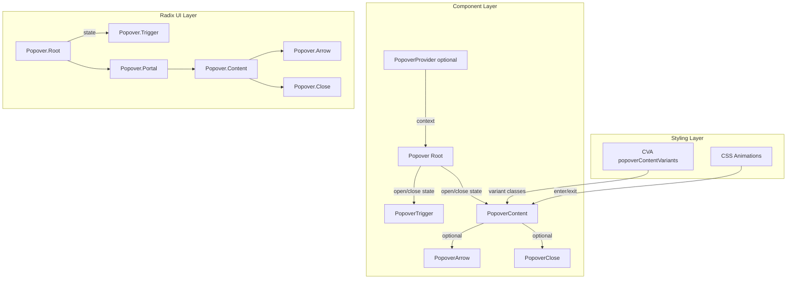

# Design Document: Popover Component สำหรับ Nim UI

## Overview

Popover component เพิ่ม overlay component ให้กับ Nim UI โดยสร้างบน `@radix-ui/react-popover` primitive ที่จัดการ accessibility, positioning, focus trapping, และ keyboard interactions ให้อัตโนมัติ

แนวทางหลัก:
- ใช้ Radix UI Popover primitive เป็น base (เหมือน Tooltip ใช้ Radix Tooltip, Modal ใช้ Radix Dialog)
- ใช้ CVA pattern สำหรับ variant styling ตามแบบแผนของ library
- ใช้ Radix Portal สำหรับ render popover content นอก DOM hierarchy
- ใช้ CSS animation ที่มีอยู่แล้ว (animate-fade-in, animate-fade-out) สำหรับ enter/exit
- ไฟล์ทั้งหมดอยู่ใน `packages/ui/src/components/` เป็น flat kebab-case
- ใช้ compound component pattern เหมือน Tooltip: PopoverProvider (optional), Popover (Root), PopoverTrigger, PopoverContent, PopoverArrow, PopoverClose

ไฟล์ที่ต้องสร้าง:
- `popover.tsx` — Popover component ทั้งหมด (Provider, Root, Trigger, Content, Arrow, Close)
- `popover.test.tsx` — Unit tests และ property-based tests
- อัปเดต `index.ts` — เพิ่ม export

## Architecture



การทำงาน:
1. นักพัฒนาใช้ `Popover` (Root) ครอบ `PopoverTrigger` และ `PopoverContent`
2. เมื่อผู้ใช้คลิก trigger, Radix จัดการเปิด popover
3. `PopoverContent` ถูก render ผ่าน Radix Portal ที่ตำแหน่งตาม `side` prop
4. CVA จัดการ variant styling (default / outline) รวมถึง dark mode classes
5. Focus ถูก trap ภายใน popover content อัตโนมัติ
6. เมื่อผู้ใช้คลิกนอก popover, กด Escape, หรือคลิก PopoverClose, popover ปิดพร้อม exit animation

## Components and Interfaces

### 1. PopoverProvider (`popover.tsx`)

Optional context wrapper สำหรับ popover หลายตัว:

```typescript
export interface PopoverProviderProps {
  children: React.ReactNode;
}

const PopoverProvider: React.FC<PopoverProviderProps> = ({ children }) => (
  <>{children}</>
);
```

### 2. Popover (Root) (`popover.tsx`)

Re-export Radix UI Popover Root:

```typescript
export interface PopoverProps {
  children: React.ReactNode;
  open?: boolean;
  defaultOpen?: boolean;
  onOpenChange?: (open: boolean) => void;
  modal?: boolean;
}

const Popover = RadixPopover.Root;
```

### 3. PopoverTrigger (`popover.tsx`)

Re-export Radix UI Popover Trigger ด้วย forwardRef:

```typescript
const PopoverTrigger = React.forwardRef<
  React.ComponentRef<typeof RadixPopover.Trigger>,
  React.ComponentPropsWithoutRef<typeof RadixPopover.Trigger>
>(({ className, ...props }, ref) => (
  <RadixPopover.Trigger ref={ref} className={cn(className)} {...props} />
));
```

### 4. PopoverContent (`popover.tsx`)

Component หลักที่ใช้ CVA สำหรับ variant styling:

```typescript
const popoverContentVariants = cva(
  // base: layout, z-index, padding, border-radius, shadow, animation
  'z-50 w-72 rounded-md p-4 shadow-md outline-none data-[state=open]:animate-fade-in data-[state=closed]:animate-fade-out',
  {
    variants: {
      variant: {
        default:
          'border border-neutral-200 bg-white text-neutral-900 dark:border-neutral-700 dark:bg-neutral-800 dark:text-neutral-100',
        outline:
          'border-2 border-neutral-300 bg-white text-neutral-900 dark:border-neutral-600 dark:bg-neutral-800 dark:text-neutral-100',
      },
    },
    defaultVariants: {
      variant: 'default',
    },
  }
);

export interface PopoverContentProps
  extends React.ComponentPropsWithoutRef<typeof RadixPopover.Content>,
    VariantProps<typeof popoverContentVariants> {
  showArrow?: boolean;
  sideOffset?: number;
}

const PopoverContent = React.forwardRef<
  React.ComponentRef<typeof RadixPopover.Content>,
  PopoverContentProps
>(
  (
    {
      className,
      variant,
      showArrow = false,
      sideOffset = 4,
      side = 'bottom',
      children,
      ...props
    },
    ref
  ) => (
    <RadixPopover.Portal>
      <RadixPopover.Content
        ref={ref}
        side={side}
        sideOffset={sideOffset}
        className={cn(popoverContentVariants({ variant }), className)}
        {...props}
      >
        {children}
        {showArrow && <PopoverArrow variant={variant ?? undefined} />}
      </RadixPopover.Content>
    </RadixPopover.Portal>
  )
);
```

### 5. PopoverArrow (`popover.tsx`)

Arrow component ที่สีสอดคล้องกับ variant:

```typescript
export interface PopoverArrowProps
  extends React.ComponentPropsWithoutRef<typeof RadixPopover.Arrow> {
  variant?: 'default' | 'outline';
}

const PopoverArrow = React.forwardRef<
  React.ComponentRef<typeof RadixPopover.Arrow>,
  PopoverArrowProps
>(({ className, variant = 'default', ...props }, ref) => (
  <RadixPopover.Arrow
    ref={ref}
    className={cn('fill-white dark:fill-neutral-800', className)}
    {...props}
  />
));
```

### 6. PopoverClose (`popover.tsx`)

ปุ่มปิด popover:

```typescript
export interface PopoverCloseProps
  extends React.ComponentPropsWithoutRef<typeof RadixPopover.Close> {}

const PopoverClose = React.forwardRef<
  React.ComponentRef<typeof RadixPopover.Close>,
  PopoverCloseProps
>(({ className, ...props }, ref) => (
  <RadixPopover.Close ref={ref} className={cn(className)} {...props} />
));
```

## Data Models

### PopoverContentProps

| Field | Type | Required | Description |
|-------|------|----------|-------------|
| variant | 'default' \| 'outline' | ❌ | รูปแบบสี (default: 'default') |
| side | 'top' \| 'bottom' \| 'left' \| 'right' | ❌ | ตำแหน่งแสดงผล (default: 'bottom') |
| sideOffset | number | ❌ | ระยะห่างจาก trigger เป็น px (default: 4) |
| showArrow | boolean | ❌ | แสดง arrow indicator (default: false) |
| className | string | ❌ | custom CSS classes |
| children | React.ReactNode | ✅ | เนื้อหาของ popover |

### PopoverProps (Root)

| Field | Type | Required | Description |
|-------|------|----------|-------------|
| open | boolean | ❌ | controlled open state |
| defaultOpen | boolean | ❌ | initial open state (uncontrolled) |
| onOpenChange | (open: boolean) => void | ❌ | callback เมื่อ open state เปลี่ยน |
| modal | boolean | ❌ | modal mode (focus trap + overlay) |
| children | React.ReactNode | ✅ | Trigger + Content |

### PopoverCloseProps

| Field | Type | Required | Description |
|-------|------|----------|-------------|
| asChild | boolean | ❌ | ใช้ child element แทน default button |
| className | string | ❌ | custom CSS classes |
| children | React.ReactNode | ❌ | เนื้อหาของปุ่มปิด |


## Correctness Properties

*A property is a characteristic or behavior that should hold true across all valid executions of a system — essentially, a formal statement about what the system should do. Properties serve as the bridge between human-readable specifications and machine-verifiable correctness guarantees.*

### Property 1: Popover variant styling includes correct light and dark mode classes

*For any* valid variant value from the set {default, outline}, the `popoverContentVariants` CVA function should produce a class string that contains the correct light mode classes (bg-white/text-neutral-900/border for default, bg-white/text-neutral-900/border-2 for outline) AND corresponding dark mode classes (prefixed with `dark:`) AND animation classes (animate-fade-in, animate-fade-out).

**Validates: Requirements 2.1, 2.2, 2.3, 2.4, 2.10**

### Property 2: Arrow presence matches showArrow prop

*For any* boolean value of showArrow and any valid variant, when PopoverContent is rendered with that showArrow value, the Popover_Arrow element should be present in the rendered output if and only if showArrow is true.

**Validates: Requirements 3.1, 3.3**

### Property 3: Arrow fill color is consistent across variants

*For any* valid variant value from the set {default, outline}, the PopoverArrow component should produce a class string containing `fill-white` for light mode and `dark:fill-neutral-800` for dark mode.

**Validates: Requirements 3.2**

### Property 4: Module exports completeness

*For any* required export name from the set {Popover, PopoverProvider, PopoverTrigger, PopoverContent, PopoverArrow, PopoverClose, popoverContentVariants}, the module should export a defined value.

**Validates: Requirements 7.1, 7.2, 7.3, 7.4**

## Error Handling

Popover component มีกรณี error ที่ต้องจัดการ:

1. **PopoverContent ถูกใช้นอก Popover Root**: Radix จะ throw error ถ้า Content อยู่นอก Root — เป็น developer error ที่ TypeScript types ช่วยป้องกันได้บางส่วน

2. **Popover trigger element ไม่รองรับ ref**: Radix Popover.Trigger ต้องการ ref forwarding — ถ้า trigger เป็น custom component ที่ไม่ forward ref จะแสดง React warning ใน console

3. **Portal container ไม่มีอยู่**: Radix Portal จะ render ไปที่ document.body เป็น default — ถ้า document.body ไม่พร้อม (SSR) จะไม่ render popover content

4. **Side collision**: เมื่อ popover ไม่มีพื้นที่เพียงพอที่ side ที่กำหนด, Radix จะ flip ไปด้านตรงข้ามอัตโนมัติผ่าน collision detection ในตัว

5. **Focus management**: Radix จัดการ focus trap อัตโนมัติ — เมื่อเปิด popover focus จะย้ายเข้าไปใน content, เมื่อปิด focus จะกลับไปที่ trigger

## Testing Strategy

### Dual Testing Approach

ใช้ทั้ง unit tests และ property-based tests ร่วมกัน:

- **Unit tests** (Vitest + React Testing Library): ทดสอบ rendering, interactions, accessibility, edge cases
- **Property-based tests** (fast-check): ทดสอบ universal properties ข้าม inputs ทั้งหมด

### Property-Based Testing

ใช้ `fast-check` library ที่มีอยู่แล้วใน project

**Configuration**:
- Minimum 100 iterations ต่อ property test
- แต่ละ test ต้อง reference design document property
- Tag format: **Feature: popover, Property {number}: {property_text}**
- แต่ละ correctness property ต้องถูก implement เป็น property-based test เดียว

**Property tests ที่ต้องเขียน**:

1. **Property 1**: Variant styling — generate random variants, verify CVA output contains correct light/dark/animation classes
2. **Property 2**: Arrow presence — generate random (variant, showArrow) combinations, verify arrow presence matches showArrow boolean
3. **Property 3**: Arrow fill color — generate random variants, verify arrow fill class is fill-white and dark:fill-neutral-800
4. **Property 4**: Module exports — verify all required exports exist and are defined

### Unit Tests

Unit tests จะเน้น:

- **Rendering**: Popover renders with default props, PopoverContent renders in portal
- **Variants**: แต่ละ variant render ด้วย classes ที่ถูกต้อง
- **Interactions**: click เปิด popover, click outside ปิด, Escape ปิด, PopoverClose ปิด
- **Accessibility**: role="dialog", focus trap, keyboard navigation, focus return to trigger
- **Defaults**: default side เป็น bottom, default sideOffset เป็น 4
- **Edge cases**: controlled mode (open/onOpenChange), custom className, forwardRef, PopoverClose with asChild

### Test File Organization

- ไฟล์ test หลัก: `packages/ui/src/components/popover.test.tsx`
- ทั้ง unit tests และ property-based tests อยู่ในไฟล์เดียวกัน
- จัดกลุ่มด้วย `describe` blocks: rendering, variants, interactions, accessibility, close, properties
