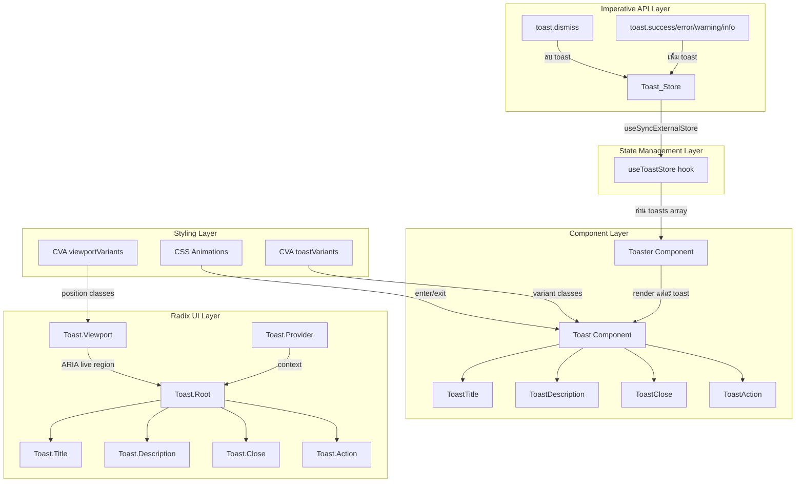

# Design Document: ระบบ Toast/Notification สำหรับ Tiinno UI

## Overview

ระบบ Toast/Notification เพิ่ม feedback component ให้กับ Tiinno UI โดยสร้างบน `@radix-ui/react-toast` primitive ที่จัดการ accessibility, swipe dismiss, และ auto-dismiss ให้อัตโนมัติ

แนวทางหลัก:
- ใช้ Radix UI Toast primitive เป็น base (เหมือน Modal ใช้ Radix Dialog, Drawer ใช้ Radix Dialog)
- ใช้ CVA pattern สำหรับ variant styling ตามแบบแผนของ library
- ใช้ external store (ไม่ผูกกับ React tree) สำหรับ imperative API
- ใช้ `useSyncExternalStore` hook เพื่อ sync store กับ React
- ใช้ CSS animation ที่มีอยู่แล้ว (animate-fade-in, animate-slide-in-from-*) สำหรับ enter/exit
- ไฟล์ทั้งหมดอยู่ใน `packages/ui/src/components/` เป็น flat kebab-case

ไฟล์ที่ต้องสร้าง:
- `toast.tsx` — Toast component ทั้งหมด (Provider, Viewport, Toast, sub-components)
- `toast-store.ts` — External store และ imperative API
- `toast.test.tsx` — Unit tests และ property-based tests
- อัปเดต `index.ts` — เพิ่ม export

## Architecture



การทำงาน:
1. นักพัฒนาเรียก `toast.success("Saved!")` จาก event handler
2. Toast_Store เพิ่ม toast object ใหม่เข้า internal array และ notify subscribers
3. `Toaster` component (ที่วางไว้ที่ root ของ app) ใช้ `useSyncExternalStore` เพื่ออ่าน toasts
4. แต่ละ toast ถูก render เป็น Radix Toast.Root ภายใน Toast.Provider + Toast.Viewport
5. Radix จัดการ auto-dismiss timer, swipe gesture, ARIA announcements อัตโนมัติ
6. เมื่อ toast ถูกปิด (auto หรือ manual), onOpenChange callback ลบ toast ออกจาก store

## Components and Interfaces

### 1. Toast Store (`toast-store.ts`)

External store ที่จัดการ state ของ toast ทั้งหมด:

```typescript
// Toast data ที่เก็บใน store
interface ToastData {
  id: string;
  title?: string;
  description?: string;
  variant: 'default' | 'success' | 'error' | 'warning' | 'info';
  duration?: number;
  action?: {
    label: string;
    altText: string;
    onClick: () => void;
  };
}

// Options สำหรับสร้าง toast
type ToastOptions = Omit<ToastData, 'id' | 'variant'> & {
  variant?: ToastData['variant'];
};

// Store API
interface ToastStoreAPI {
  getSnapshot: () => ToastData[];
  subscribe: (listener: () => void) => () => void;
  add: (toast: ToastData) => string;
  dismiss: (id: string) => void;
  clear: () => void;
}
```

Implementation ใช้ pattern เดียวกับ external store ทั่วไป:
- `listeners` Set สำหรับ subscribers
- `toasts` array เป็น immutable (สร้าง array ใหม่ทุกครั้งที่เปลี่ยน)
- `subscribe()` คืน unsubscribe function
- `getSnapshot()` คืน reference เดิมถ้าไม่มีการเปลี่ยนแปลง

### 2. Imperative API (`toast-store.ts`)

```typescript
// ฟังก์ชันหลัก
function toast(options: ToastOptions): string;

// Shorthand functions
toast.success = (titleOrOptions: string | ToastOptions): string;
toast.error = (titleOrOptions: string | ToastOptions): string;
toast.warning = (titleOrOptions: string | ToastOptions): string;
toast.info = (titleOrOptions: string | ToastOptions): string;

// จัดการ toast
toast.dismiss = (id: string): void;
toast.clear = (): void;
```

Shorthand functions รับได้ทั้ง string (เป็น title) หรือ ToastOptions object

### 3. Toast Component (`toast.tsx`)

ใช้ Radix UI Toast primitive เป็น base:

```typescript
// Provider — ครอบ app
const ToastProvider = RadixToast.Provider;

// Viewport — ตำแหน่งแสดง toast
const viewportVariants = cva(
  'fixed z-[100] flex flex-col gap-sm p-md max-h-screen',
  {
    variants: {
      position: {
        'top-right': 'top-0 right-0',
        'top-left': 'top-0 left-0',
        'top-center': 'top-0 left-1/2 -translate-x-1/2',
        'bottom-right': 'bottom-0 right-0',
        'bottom-left': 'bottom-0 left-0',
        'bottom-center': 'bottom-0 left-1/2 -translate-x-1/2',
      },
    },
    defaultVariants: {
      position: 'bottom-right',
    },
  }
);

// Toast — แต่ละรายการ
const toastVariants = cva(
  // base: layout, border, shadow, animation, transition
  'group pointer-events-auto relative flex w-full items-center justify-between gap-md overflow-hidden rounded-lg border p-md shadow-lg transition-all data-[state=open]:animate-slide-in-from-right data-[state=closed]:animate-fade-out data-[swipe=move]:translate-x-[var(--radix-toast-swipe-move-x)] data-[swipe=cancel]:translate-x-0 data-[swipe=end]:animate-slide-out-to-right',
  {
    variants: {
      variant: {
        default: 'border-neutral-200 bg-white text-neutral-900 dark:border-neutral-700 dark:bg-neutral-800 dark:text-neutral-100',
        success: 'border-success-500/30 bg-success-50 text-success-700 dark:bg-success-500/10 dark:text-success-500 dark:border-success-500/20',
        error: 'border-error-500/30 bg-error-50 text-error-700 dark:bg-error-500/10 dark:text-error-500 dark:border-error-500/20',
        warning: 'border-warning-500/30 bg-warning-50 text-warning-700 dark:bg-warning-500/10 dark:text-warning-500 dark:border-warning-500/20',
        info: 'border-primary-500/30 bg-primary-50 text-primary-700 dark:bg-primary-500/10 dark:text-primary-500 dark:border-primary-500/20',
      },
    },
    defaultVariants: {
      variant: 'default',
    },
  }
);
```

### 4. Sub-components (`toast.tsx`)

```typescript
// ToastTitle — หัวข้อ toast
const ToastTitle = React.forwardRef<...>(({ className, ...props }, ref) => (
  <RadixToast.Title
    ref={ref}
    className={cn('text-sm font-semibold', className)}
    {...props}
  />
));

// ToastDescription — รายละเอียด toast
const ToastDescription = React.forwardRef<...>(({ className, ...props }, ref) => (
  <RadixToast.Description
    ref={ref}
    className={cn('text-sm opacity-90', className)}
    {...props}
  />
));

// ToastClose — ปุ่มปิด
const ToastClose = React.forwardRef<...>(({ className, ...props }, ref) => (
  <RadixToast.Close
    ref={ref}
    className={cn(
      'absolute right-2 top-2 rounded-md p-1 opacity-0 transition-opacity',
      'hover:opacity-100 focus:opacity-100 focus:outline-none focus:ring-2',
      'group-hover:opacity-100',
      className
    )}
    aria-label="ปิดการแจ้งเตือน"
    {...props}
  >
    {/* X icon */}
  </RadixToast.Close>
));

// ToastAction — action button ภายใน toast
const ToastAction = React.forwardRef<...>(({ className, ...props }, ref) => (
  <RadixToast.Action
    ref={ref}
    className={cn(
      'inline-flex items-center justify-center rounded-md text-sm font-medium',
      'ring-offset-white transition-colors',
      'hover:bg-neutral-100 focus:outline-none focus:ring-2',
      className
    )}
    {...props}
  />
));
```

### 5. Toaster Component (`toast.tsx`)

Convenience component ที่รวม Provider + Viewport + render toasts จาก store:

```typescript
interface ToasterProps {
  position?: 'top-right' | 'top-left' | 'bottom-right' | 'bottom-left' | 'top-center' | 'bottom-center';
  duration?: number;
  swipeDirection?: 'right' | 'left' | 'up' | 'down';
}

function Toaster({ position = 'bottom-right', duration = 5000, swipeDirection = 'right' }: ToasterProps) {
  const toasts = useSyncExternalStore(
    toastStore.subscribe,
    toastStore.getSnapshot,
    toastStore.getSnapshot // server snapshot
  );

  return (
    <ToastProvider duration={duration} swipeDirection={swipeDirection}>
      {toasts.map((t) => (
        <Toast
          key={t.id}
          variant={t.variant}
          duration={t.duration}
          onOpenChange={(open) => { if (!open) toastStore.dismiss(t.id); }}
        >
          {t.title && <ToastTitle>{t.title}</ToastTitle>}
          {t.description && <ToastDescription>{t.description}</ToastDescription>}
          {t.action && (
            <ToastAction altText={t.action.altText} onClick={t.action.onClick}>
              {t.action.label}
            </ToastAction>
          )}
          <ToastClose />
        </Toast>
      ))}
      <ToastViewport position={position} />
    </ToastProvider>
  );
}
```

### 6. useToastStore Hook (`toast-store.ts`)

```typescript
function useToastStore(): ToastData[] {
  return useSyncExternalStore(
    toastStore.subscribe,
    toastStore.getSnapshot,
    toastStore.getSnapshot
  );
}
```

## Data Models

### ToastData

| Field | Type | Required | Description |
|-------|------|----------|-------------|
| id | string | ✅ | unique identifier (crypto.randomUUID หรือ counter) |
| title | string | ❌ | หัวข้อ toast |
| description | string | ❌ | รายละเอียด toast |
| variant | 'default' \| 'success' \| 'error' \| 'warning' \| 'info' | ✅ | รูปแบบสี (default: 'default') |
| duration | number | ❌ | override duration เป็น ms (default: ใช้ค่าจาก Provider) |
| action | ToastActionData | ❌ | action button data |

### ToastActionData

| Field | Type | Required | Description |
|-------|------|----------|-------------|
| label | string | ✅ | ข้อความบน action button |
| altText | string | ✅ | accessible description ของ action |
| onClick | () => void | ✅ | callback เมื่อกด action |

### Toast Store State

```typescript
// Internal state ของ store
{
  toasts: ToastData[];     // immutable array — สร้างใหม่ทุกครั้งที่เปลี่ยน
  listeners: Set<() => void>;  // subscribers จาก useSyncExternalStore
}
```

### Position Type

```typescript
type ToastPosition = 'top-right' | 'top-left' | 'bottom-right' | 'bottom-left' | 'top-center' | 'bottom-center';
```


## Correctness Properties

*A property is a characteristic or behavior that should hold true across all valid executions of a system — essentially, a formal statement about what the system should do. Properties serve as the bridge between human-readable specifications and machine-verifiable correctness guarantees.*

### Property 1: Position variant maps to correct CSS classes

*For any* valid position value from the set {top-right, top-left, bottom-right, bottom-left, top-center, bottom-center}, the `viewportVariants` CVA function should produce a class string containing the correct CSS positioning classes (top-0/bottom-0, left-0/right-0/left-1/2) that correspond to that position.

**Validates: Requirements 1.3**

### Property 2: Toast variant styling includes light and dark mode classes

*For any* valid variant value from the set {default, success, error, warning, info}, the `toastVariants` CVA function should produce a class string that contains both light mode color classes (using the appropriate design token prefix: success-*, error-*, warning-*, primary-*) AND dark mode classes (prefixed with `dark:`).

**Validates: Requirements 2.1, 2.2, 2.3, 2.4, 2.5, 2.6**

### Property 3: Toast store maintains chronological ordering

*For any* sequence of N toast additions (where N >= 1), the store's `getSnapshot()` should return toasts in the same order they were added. The toast at index i should have been added before the toast at index i+1.

**Validates: Requirements 1.5**

### Property 4: Toast add round-trip — toast() creates findable toast with matching properties

*For any* valid ToastOptions (random title, description, variant, duration), calling `toast(options)` should return a string id, and the store's `getSnapshot()` should contain a toast with that id whose title, description, variant, and duration match the provided options.

**Validates: Requirements 6.2, 6.4, 6.6**

### Property 5: Toast dismiss removes only the targeted toast

*For any* store containing N toasts (N >= 2), dismissing one toast by its id should result in a store of N-1 toasts where the dismissed toast is absent and all other toasts remain unchanged in order.

**Validates: Requirements 6.5, 6.7**

### Property 6: Shorthand functions set correct variant

*For any* shorthand function from the set {toast.success, toast.error, toast.warning, toast.info} and any title string, calling the shorthand should create a toast in the store whose variant matches the function name (success, error, warning, info respectively).

**Validates: Requirements 6.3**

### Property 7: Module exports completeness

*For any* required export name from the set {Toast, ToastProvider, ToastViewport, ToastTitle, ToastDescription, ToastClose, ToastAction, Toaster, toast, toastVariants, viewportVariants}, the module should export a defined value.

**Validates: Requirements 8.1, 8.2, 8.4**

## Error Handling

ระบบ Toast มีกรณี error ที่ต้องจัดการ:

1. **Toast ถูกสร้างก่อน Toaster mount**: Toast_Store เก็บ toast ไว้ใน memory ก่อน — เมื่อ Toaster mount จะอ่าน toasts ที่มีอยู่แล้วผ่าน `useSyncExternalStore` และ render ทั้งหมด ไม่มี toast หาย

2. **toast() ถูกเรียกด้วย options ว่าง**: ถ้าไม่มีทั้ง title และ description, toast ยังคงถูกสร้างและ render (อาจแสดงเฉพาะ close button) — ไม่ throw error เพราะอาจมี custom children ใน declarative API

3. **toast.dismiss() ด้วย id ที่ไม่มีอยู่**: ไม่ throw error — เป็น no-op เงียบๆ เพราะ toast อาจถูกปิดไปแล้วจาก auto-dismiss

4. **Store memory leak จาก toast ที่ไม่ถูกปิด**: Radix Toast จัดการ auto-dismiss timer อัตโนมัติ เมื่อ toast ถูกปิด (auto หรือ manual), `onOpenChange(false)` callback จะลบ toast ออกจาก store

5. **Server-side rendering**: `useSyncExternalStore` รับ `getServerSnapshot` parameter — คืน empty array `[]` เพื่อไม่ render toast บน server

## Testing Strategy

### Dual Testing Approach

ใช้ทั้ง unit tests และ property-based tests ร่วมกัน:

- **Unit tests** (Vitest + React Testing Library): ทดสอบ rendering, interactions, accessibility, edge cases
- **Property-based tests** (fast-check): ทดสอบ universal properties ข้าม inputs ทั้งหมด

### Property-Based Testing

ใช้ `fast-check` library ที่มีอยู่แล้วใน project

**Configuration**:
- Minimum 100 iterations ต่อ property test
- แต่ละ test ต้อง reference design document property
- Tag format: **Feature: toast-notification-system, Property {number}: {property_text}**
- แต่ละ correctness property ต้องถูก implement เป็น property-based test เดียว

**Property tests ที่ต้องเขียน**:

1. **Property 1**: Position variant mapping — generate random positions, verify CVA output contains correct CSS classes
2. **Property 2**: Variant styling with dark mode — generate random variants, verify CVA output contains correct token classes and dark: prefixes
3. **Property 3**: Chronological ordering — generate random sequences of toast additions, verify store ordering
4. **Property 4**: Add round-trip — generate random toast options, verify toast() creates findable toast with matching properties
5. **Property 5**: Dismiss isolation — generate random stores with multiple toasts, dismiss one, verify only that one is removed
6. **Property 6**: Shorthand variant mapping — generate random shorthand calls, verify correct variant is set
7. **Property 7**: Module exports — verify all required exports exist

### Unit Tests

Unit tests จะเน้น:

- **Rendering**: Toast renders with default props, Toaster renders without errors
- **Variants**: แต่ละ variant render ด้วย classes ที่ถูกต้อง
- **Interactions**: คลิกปุ่มปิด, กด Escape key
- **Accessibility**: ARIA live region, aria-label บน close button, focus navigation
- **Edge cases**: toast ที่ไม่มี title, duration Infinity, dismiss id ที่ไม่มีอยู่
- **Integration**: Toaster + toast store ทำงานร่วมกัน

### Test File Organization

- ไฟล์ test หลัก: `packages/ui/src/components/toast.test.tsx`
- ทั้ง unit tests และ property-based tests อยู่ในไฟล์เดียวกัน
- จัดกลุ่มด้วย `describe` blocks: rendering, variants, interactions, accessibility, store, properties
