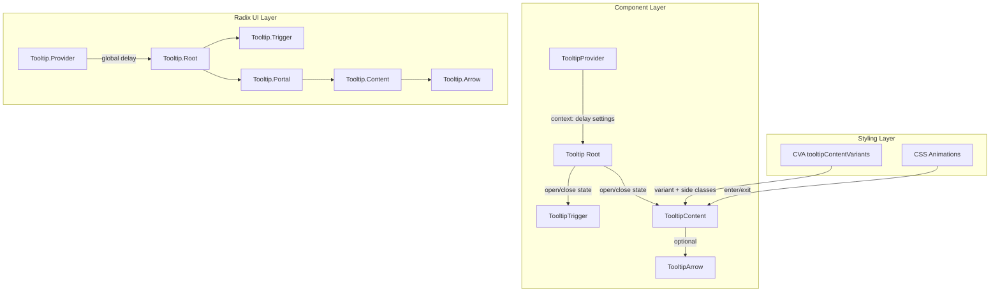

# Design Document: Tooltip Component สำหรับ Tiinno UI

## Overview

Tooltip component เพิ่ม overlay component ให้กับ Tiinno UI โดยสร้างบน `@radix-ui/react-tooltip` primitive ที่จัดการ accessibility, positioning, delay, และ keyboard interactions ให้อัตโนมัติ

แนวทางหลัก:
- ใช้ Radix UI Tooltip primitive เป็น base (เหมือน Modal ใช้ Radix Dialog, Toast ใช้ Radix Toast)
- ใช้ CVA pattern สำหรับ variant styling ตามแบบแผนของ library
- ใช้ Radix Portal สำหรับ render tooltip content นอก DOM hierarchy
- ใช้ CSS animation ที่มีอยู่แล้ว (animate-fade-in, animate-fade-out) สำหรับ enter/exit
- ไฟล์ทั้งหมดอยู่ใน `packages/ui/src/components/` เป็น flat kebab-case

ไฟล์ที่ต้องสร้าง:
- `tooltip.tsx` — Tooltip component ทั้งหมด (Provider, Root, Trigger, Content, Arrow)
- `tooltip.test.tsx` — Unit tests และ property-based tests
- อัปเดต `index.ts` — เพิ่ม export

## Architecture



การทำงาน:
1. นักพัฒนาวาง `TooltipProvider` ที่ root ของ app (หรือใช้ default)
2. ใช้ `Tooltip` (Root) ครอบ `TooltipTrigger` และ `TooltipContent`
3. เมื่อผู้ใช้ hover หรือ focus บน trigger, Radix จัดการ delay timer แล้วเปิด tooltip
4. `TooltipContent` ถูก render ผ่าน Radix Portal ที่ตำแหน่งตาม `side` prop
5. CVA จัดการ variant styling (default dark / light) รวมถึง dark mode classes
6. เมื่อผู้ใช้ออกจาก hover/focus หรือกด Escape, tooltip ปิดพร้อม exit animation

## Components and Interfaces

### 1. TooltipProvider (`tooltip.tsx`)

Re-export Radix UI Tooltip Provider พร้อม default props:

```typescript
export interface TooltipProviderProps {
  children: React.ReactNode;
  delayDuration?: number;      // default: 300
  skipDelayDuration?: number;  // default: 300
  disableHoverableContent?: boolean;
}

const TooltipProvider: React.FC<TooltipProviderProps> = ({
  delayDuration = 300,
  skipDelayDuration = 300,
  ...props
}) => (
  <RadixTooltip.Provider
    delayDuration={delayDuration}
    skipDelayDuration={skipDelayDuration}
    {...props}
  />
);
```

### 2. Tooltip (Root) (`tooltip.tsx`)

Re-export Radix UI Tooltip Root:

```typescript
export interface TooltipProps {
  children: React.ReactNode;
  open?: boolean;
  defaultOpen?: boolean;
  onOpenChange?: (open: boolean) => void;
  delayDuration?: number;
}

const Tooltip = RadixTooltip.Root;
```

### 3. TooltipTrigger (`tooltip.tsx`)

Re-export Radix UI Tooltip Trigger ด้วย forwardRef:

```typescript
const TooltipTrigger = React.forwardRef<
  React.ComponentRef<typeof RadixTooltip.Trigger>,
  React.ComponentPropsWithoutRef<typeof RadixTooltip.Trigger>
>(({ className, ...props }, ref) => (
  <RadixTooltip.Trigger ref={ref} className={cn(className)} {...props} />
));
```

### 4. TooltipContent (`tooltip.tsx`)

Component หลักที่ใช้ CVA สำหรับ variant styling:

```typescript
const tooltipContentVariants = cva(
  // base: layout, z-index, padding, typography, border-radius, animation
  'z-50 overflow-hidden rounded-md px-3 py-1.5 text-sm data-[state=delayed-open]:animate-fade-in data-[state=closed]:animate-fade-out',
  {
    variants: {
      variant: {
        default:
          'bg-neutral-900 text-neutral-50 dark:bg-neutral-50 dark:text-neutral-900',
        light:
          'border border-neutral-200 bg-white text-neutral-900 shadow-md dark:border-neutral-700 dark:bg-neutral-800 dark:text-neutral-100',
      },
    },
    defaultVariants: {
      variant: 'default',
    },
  }
);

export interface TooltipContentProps
  extends React.ComponentPropsWithoutRef<typeof RadixTooltip.Content>,
    VariantProps<typeof tooltipContentVariants> {
  showArrow?: boolean;
  sideOffset?: number;
}

const TooltipContent = React.forwardRef<
  React.ComponentRef<typeof RadixTooltip.Content>,
  TooltipContentProps
>(({ className, variant, showArrow = false, sideOffset = 4, side = 'top', children, ...props }, ref) => (
  <RadixTooltip.Portal>
    <RadixTooltip.Content
      ref={ref}
      side={side}
      sideOffset={sideOffset}
      className={cn(tooltipContentVariants({ variant }), className)}
      {...props}
    >
      {children}
      {showArrow && (
        <TooltipArrow variant={variant} />
      )}
    </RadixTooltip.Content>
  </RadixTooltip.Portal>
));
```

### 5. TooltipArrow (`tooltip.tsx`)

Arrow component ที่สีสอดคล้องกับ variant:

```typescript
export interface TooltipArrowProps
  extends React.ComponentPropsWithoutRef<typeof RadixTooltip.Arrow> {
  variant?: 'default' | 'light';
}

const TooltipArrow = React.forwardRef<
  React.ComponentRef<typeof RadixTooltip.Arrow>,
  TooltipArrowProps
>(({ className, variant = 'default', ...props }, ref) => (
  <RadixTooltip.Arrow
    ref={ref}
    className={cn(
      variant === 'default'
        ? 'fill-neutral-900 dark:fill-neutral-50'
        : 'fill-white dark:fill-neutral-800',
      className
    )}
    {...props}
  />
));
```

## Data Models

### TooltipContentProps

| Field | Type | Required | Description |
|-------|------|----------|-------------|
| variant | 'default' \| 'light' | ❌ | รูปแบบสี (default: 'default') |
| side | 'top' \| 'bottom' \| 'left' \| 'right' | ❌ | ตำแหน่งแสดงผล (default: 'top') |
| sideOffset | number | ❌ | ระยะห่างจาก trigger เป็น px (default: 4) |
| showArrow | boolean | ❌ | แสดง arrow indicator (default: false) |
| className | string | ❌ | custom CSS classes |
| children | React.ReactNode | ✅ | เนื้อหาของ tooltip |

### TooltipProviderProps

| Field | Type | Required | Description |
|-------|------|----------|-------------|
| delayDuration | number | ❌ | delay ก่อนแสดง tooltip เป็น ms (default: 300) |
| skipDelayDuration | number | ❌ | delay สำหรับ tooltip ถัดไปเมื่อเพิ่งปิด tooltip อื่น (default: 300) |
| disableHoverableContent | boolean | ❌ | ปิดการ hover บน tooltip content (default: false) |
| children | React.ReactNode | ✅ | application content |

### TooltipProps (Root)

| Field | Type | Required | Description |
|-------|------|----------|-------------|
| open | boolean | ❌ | controlled open state |
| defaultOpen | boolean | ❌ | initial open state (uncontrolled) |
| onOpenChange | (open: boolean) => void | ❌ | callback เมื่อ open state เปลี่ยน |
| delayDuration | number | ❌ | override delay จาก Provider |
| children | React.ReactNode | ✅ | Trigger + Content |


## Correctness Properties

*A property is a characteristic or behavior that should hold true across all valid executions of a system — essentially, a formal statement about what the system should do. Properties serve as the bridge between human-readable specifications and machine-verifiable correctness guarantees.*

### Property 1: Tooltip variant styling includes correct light and dark mode classes

*For any* valid variant value from the set {default, light}, the `tooltipContentVariants` CVA function should produce a class string that contains the correct light mode color classes (bg-neutral-900/text-neutral-50 for default, bg-white/text-neutral-900/border for light) AND corresponding dark mode classes (prefixed with `dark:`) AND animation classes (animate-fade-in, animate-fade-out).

**Validates: Requirements 2.1, 2.2, 2.3, 2.4, 2.10**

### Property 2: Arrow presence matches showArrow prop

*For any* boolean value of showArrow and any valid variant, when TooltipContent is rendered with that showArrow value, the Tooltip_Arrow element should be present in the rendered output if and only if showArrow is true.

**Validates: Requirements 3.1, 3.3**

### Property 3: Arrow fill color matches variant

*For any* valid variant value from the set {default, light}, the TooltipArrow component should produce a class string containing the correct fill color class: `fill-neutral-900` for default variant and `fill-white` for light variant, plus corresponding dark mode fill classes.

**Validates: Requirements 3.2**

### Property 4: Module exports completeness

*For any* required export name from the set {Tooltip, TooltipProvider, TooltipTrigger, TooltipContent, TooltipArrow, tooltipContentVariants}, the module should export a defined value.

**Validates: Requirements 6.1, 6.2, 6.3, 6.4**

## Error Handling

Tooltip component มีกรณี error ที่ต้องจัดการ:

1. **TooltipContent ถูกใช้โดยไม่มี TooltipProvider**: Radix UI Tooltip ทำงานได้โดยไม่ต้องมี explicit Provider — จะใช้ default settings (delayDuration: 700ms ของ Radix) แต่แนะนำให้ใช้ TooltipProvider ของเราที่ตั้ง default เป็น 300ms

2. **TooltipContent ถูกใช้นอก Tooltip Root**: Radix จะ throw error ถ้า Content อยู่นอก Root — เป็น developer error ที่ TypeScript types ช่วยป้องกันได้บางส่วน

3. **Tooltip trigger element ไม่รองรับ ref**: Radix Tooltip.Trigger ต้องการ ref forwarding — ถ้า trigger เป็น custom component ที่ไม่ forward ref จะแสดง React warning ใน console

4. **Portal container ไม่มีอยู่**: Radix Portal จะ render ไปที่ document.body เป็น default — ถ้า document.body ไม่พร้อม (SSR) จะไม่ render tooltip content

5. **Side collision**: เมื่อ tooltip ไม่มีพื้นที่เพียงพอที่ side ที่กำหนด, Radix จะ flip ไปด้านตรงข้ามอัตโนมัติผ่าน collision detection ในตัว

## Testing Strategy

### Dual Testing Approach

ใช้ทั้ง unit tests และ property-based tests ร่วมกัน:

- **Unit tests** (Vitest + React Testing Library): ทดสอบ rendering, interactions, accessibility, edge cases
- **Property-based tests** (fast-check): ทดสอบ universal properties ข้าม inputs ทั้งหมด

### Property-Based Testing

ใช้ `fast-check` library ที่มีอยู่แล้วใน project

**Configuration**:
- Minimum 100 iterations ต่อ property test
- แต่ละ test ต้อง reference design document property
- Tag format: **Feature: tooltip, Property {number}: {property_text}**
- แต่ละ correctness property ต้องถูก implement เป็น property-based test เดียว

**Property tests ที่ต้องเขียน**:

1. **Property 1**: Variant styling — generate random variants, verify CVA output contains correct light/dark/animation classes
2. **Property 2**: Arrow presence — generate random (variant, showArrow) combinations, verify arrow presence matches showArrow boolean
3. **Property 3**: Arrow fill color — generate random variants, verify arrow fill class matches variant color scheme
4. **Property 4**: Module exports — verify all required exports exist and are defined

### Unit Tests

Unit tests จะเน้น:

- **Rendering**: Tooltip renders with default props, TooltipContent renders in portal
- **Variants**: แต่ละ variant render ด้วย classes ที่ถูกต้อง
- **Interactions**: hover แสดง tooltip, focus แสดง tooltip, Escape ปิด tooltip
- **Accessibility**: role="tooltip", aria-describedby บน trigger, keyboard focus
- **Defaults**: default side เป็น top, default sideOffset เป็น 4, default delayDuration เป็น 300
- **Edge cases**: controlled mode (open/onOpenChange), custom className, forwardRef

### Test File Organization

- ไฟล์ test หลัก: `packages/ui/src/components/tooltip.test.tsx`
- ทั้ง unit tests และ property-based tests อยู่ในไฟล์เดียวกัน
- จัดกลุ่มด้วย `describe` blocks: rendering, variants, interactions, accessibility, properties
